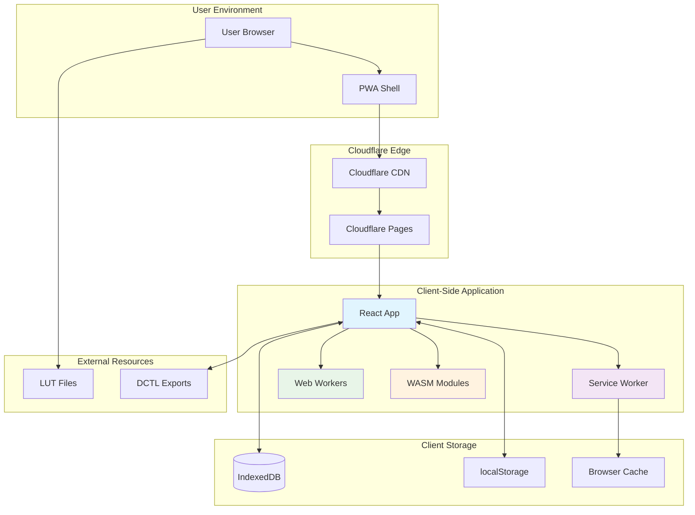
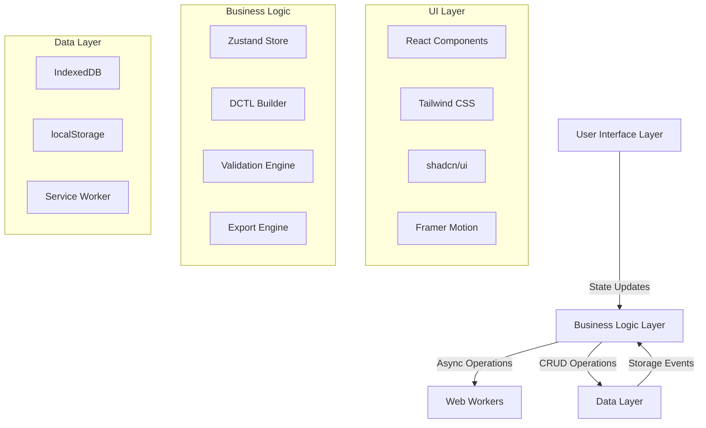
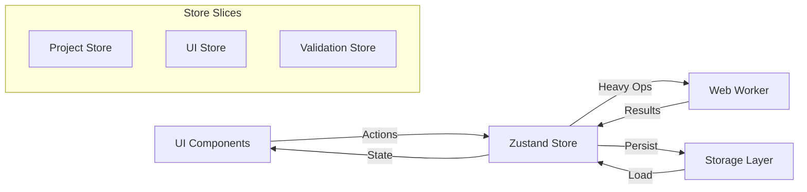
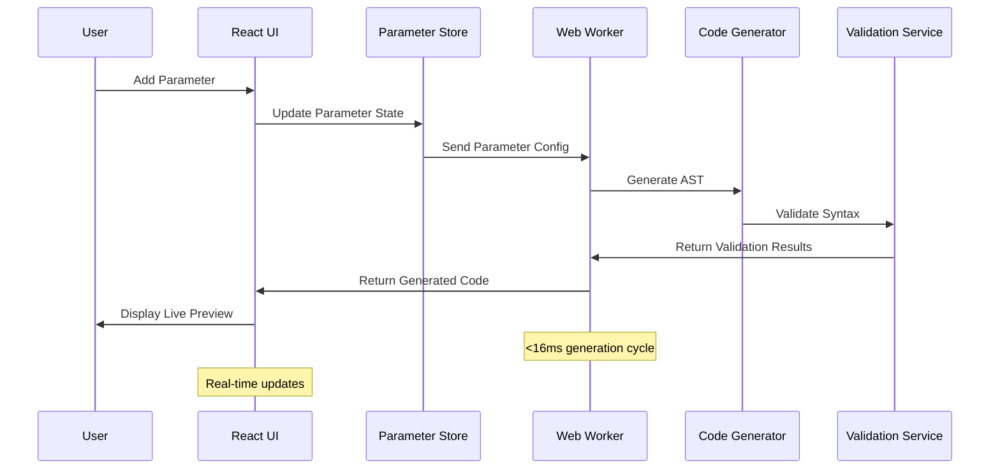
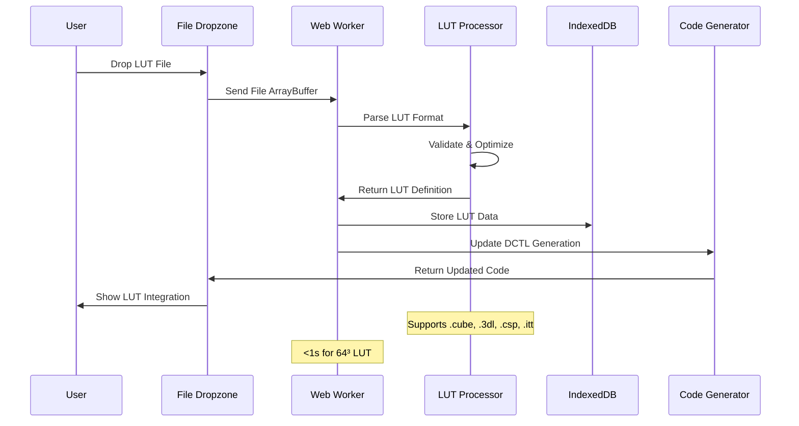
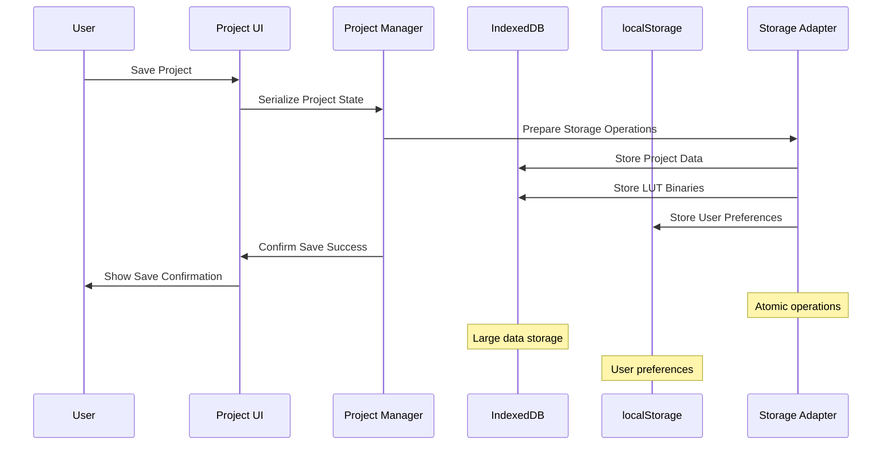

# DCTL Web Generator Fullstack Architecture Document

## Introduction

This document outlines the complete fullstack architecture for **DCTL Web Generator**, a production-grade, browser-based DCTL (DaVinci Color Transform Language) file generator. It serves as the single source of truth for AI-driven development, ensuring consistency across the entire technology stack.

This architecture implements a **zero-backend approach** with 100% client-side execution, designed for IP protection, offline capability, and maximum performance for color science professionals.

### Starter Template or Existing Project

**Status:** Greenfield project - Custom React SPA architecture optimized for DCTL generation
**Base:** Custom Vite + React + TypeScript setup with specialized DCTL processing capabilities
**Constraints:** Must remain 100% client-side with no backend dependencies

### Change Log

| Date | Version | Description | Author |
| :--- | :------ | :---------- | :----- |
| 2024-12-19 | 1.0 | Initial architecture document | Winston (System Architect) |

## High Level Architecture

### Technical Summary

DCTL Web Generator implements a sophisticated **Single Page Application (SPA)** architecture with zero-backend dependency, leveraging modern web technologies for high-performance DCTL code generation. The frontend React application handles all business logic through Web Workers, stores data locally using IndexedDB/localStorage, and provides real-time code generation with sub-100ms response times. Key integration points include Web Workers for computational heavy lifting, Service Workers for PWA offline capability, and WASM modules for LUT processing optimization. This architecture achieves PRD goals of IP protection, offline functionality, and professional-grade performance for color science workflows.

### Platform and Infrastructure Choice

**Recommended Platform:** **Cloudflare Pages + Cloudflare Workers (Edge Functions)**

**Options Considered:**
1. **Cloudflare Pages + Workers** ✅ **RECOMMENDED**
   - **Pros:** Global edge distribution, zero-config deployment, optional Workers for future API needs, excellent caching
   - **Cons:** Vendor lock-in
   - **Perfect for:** Zero-backend SPA with global performance requirements

2. **Vercel**
   - **Pros:** Excellent DX, automatic deployments, edge functions available
   - **Cons:** More expensive at scale, primarily Next.js optimized
   - **Good for:** Rapid prototyping but less optimal for pure SPA

3. **AWS S3 + CloudFront**
   - **Pros:** Ultimate control, enterprise-grade, cost-effective at scale
   - **Cons:** Complex setup, requires DevOps knowledge
   - **Good for:** Enterprise deployments with existing AWS infrastructure

**Platform:** Cloudflare Pages
**Key Services:** Cloudflare Pages (hosting), Cloudflare CDN (global distribution), Cloudflare Analytics (privacy-respecting metrics)
**Deployment Host and Regions:** Global edge network (200+ locations worldwide)

### Repository Structure

**Structure:** Monorepo with focused package organization
**Monorepo Tool:** PNPM Workspaces (lightweight, fast, disk-efficient)
**Package Organization:** Single app structure with organized feature modules (no need for separate packages given zero-backend constraint)

### High Level Architecture Diagram



### Architectural Patterns

- **Single Page Application (SPA):** Complete client-side rendering with React Router - _Rationale:_ Zero-backend requirement with rich interactivity and state management needs
- **Component-Based Architecture:** Modular React components with TypeScript - _Rationale:_ Maintainability, reusability, and type safety for complex DCTL parameter management
- **Web Worker Pattern:** Computational offloading for code generation and validation - _Rationale:_ Maintains UI responsiveness during intensive DCTL processing operations
- **Command Pattern:** User actions as serializable commands with undo/redo - _Rationale:_ Professional tool requirement for non-destructive editing workflows
- **Observer Pattern:** State management with Zustand stores - _Rationale:_ Reactive UI updates with minimal re-renders for performance optimization
- **Factory Pattern:** Parameter type creation and validation - _Rationale:_ Extensible parameter system supporting multiple DCTL data types
- **Strategy Pattern:** Multiple LUT format parsers and DCTL optimization levels - _Rationale:_ Support for diverse industry formats and performance requirements
- **Progressive Web App (PWA):** Service Worker caching with offline functionality - _Rationale:_ Professional tool reliability and mobile device support

# DCTL Web Generator - Technical Architecture

**Version:** 1.0.0  
**Date:** 2024-12-19  
**Author:** Senior Full-Stack Architect  
**Based on:** PRD v1.0

---

## 1. System Overview

### 1.1 Architecture Principles
- **Zero-Backend**: 100% client-side execution with offline-first PWA
- **Type-Safe**: End-to-end TypeScript with strict type checking
- **Performance-First**: Sub-100ms code generation, Web Workers for heavy lifting
- **Modular Design**: Plugin-based architecture with clear separation of concerns
- **Accessibility**: WCAG 2.1 AA compliance from ground up

### 1.2 High-Level Architecture Diagram



---

## 2. Frontend Architecture

### 2.1 Technology Stack

```typescript
// Core Dependencies
interface TechStack {
  runtime: {
    react: "^18.2.0";
    typescript: "^5.3.0";
    vite: "^5.0.0";
  };
  stateManagement: {
    zustand: "^4.4.0";
    immer: "^10.0.0";
  };
  ui: {
    "@radix-ui/react-*": "latest";
    "tailwindcss": "^3.4.0";
    "framer-motion": "^11.0.0";
    "lucide-react": "latest";
  };
  codeGeneration: {
    zod: "^3.22.0";
    prettier: "^3.2.0";
    "@typescript-eslint/parser": "^6.0.0";
  };
  utilities: {
    "file-saver": "^2.0.5";
    "jszip": "^3.10.1";
    "comlink": "^4.4.1";
  };
}
```

### 2.2 Project Structure

```
src/
├── components/           # React components
│   ├── ui/              # shadcn/ui components
│   ├── forms/           # Form components
│   ├── editors/         # Code/parameter editors
│   ├── panels/          # Layout panels
│   └── dialogs/         # Modal dialogs
├── stores/              # Zustand stores
│   ├── project.ts       # Project state
│   ├── parameters.ts    # Parameter management
│   ├── luts.ts         # LUT management
│   └── ui.ts           # UI state
├── lib/                 # Core business logic
│   ├── dctl/           # DCTL generation engine
│   ├── validation/     # Validation rules
│   ├── storage/        # Data persistence
│   ├── export/         # Export functionality
│   └── utils/          # Utility functions
├── workers/            # Web Workers
│   ├── dctl-builder.worker.ts
│   ├── lut-processor.worker.ts
│   └── validation.worker.ts
├── types/              # TypeScript definitions
│   ├── dctl.ts         # DCTL-specific types
│   ├── project.ts      # Project data types
│   └── api.ts          # API interfaces
├── hooks/              # Custom React hooks
├── constants/          # Application constants
└── assets/             # Static assets
```

### 2.3 Component Architecture

#### 2.3.1 Component Hierarchy
```typescript
interface ComponentArchitecture {
  layout: {
    App: "Root application component";
    Layout: "Main layout with panels";
    Header: "Navigation and project controls";
    StatusBar: "Validation and performance metrics";
  };
  
  panels: {
    ConfigPanel: "Left panel for configuration";
    PreviewPanel: "Right panel for code preview";
    ParameterSection: "Parameter management";
    LutSection: "LUT upload and configuration";
    MacroSection: "Custom macro editor";
  };
  
  editors: {
    ParameterEditor: "Individual parameter configuration";
    CodeEditor: "Monaco-based code editor";
    LutViewer: "LUT visualization and analysis";
    CurveEditor: "Bezier curve parameter editor";
  };
  
  forms: {
    SliderForm: "Float parameter configuration";
    CheckboxForm: "Boolean parameter configuration";
    EnumForm: "Dropdown parameter configuration";
    ProjectForm: "Project metadata editor";
  };
}
```

#### 2.3.2 Component Patterns
```typescript
// Base component interface
interface BaseComponent<T = {}> {
  id?: string;
  className?: string;
  children?: React.ReactNode;
  testId?: string;
  ariaLabel?: string;
  props?: T;
}

// Parameter component pattern
interface ParameterComponent<T extends ParameterType> extends BaseComponent {
  parameter: ParameterDefinition<T>;
  onChange: (value: ParameterValue<T>) => void;
  onValidate: (result: ValidationResult) => void;
  disabled?: boolean;
  readOnly?: boolean;
}

// Editor component pattern
interface EditorComponent<T> extends BaseComponent {
  value: T;
  onChange: (value: T) => void;
  onBlur?: () => void;
  onFocus?: () => void;
  validation?: ValidationResult;
  suggestions?: EditorSuggestion[];
}
```

---

## 3. State Management Architecture

### 3.1 Zustand Store Design

```typescript
// Main project store
interface ProjectStore {
  // State
  project: DctlProject | null;
  isDirty: boolean;
  lastSaved: Date | null;
  
  // Actions
  createProject: (template?: ProjectTemplate) => void;
  loadProject: (id: string) => Promise<void>;
  saveProject: () => Promise<void>;
  exportProject: (format: ExportFormat) => Promise<void>;
  
  // Parameter management
  addParameter: (type: ParameterType) => void;
  updateParameter: (id: string, updates: Partial<ParameterDefinition>) => void;
  removeParameter: (id: string) => void;
  reorderParameters: (from: number, to: number) => void;
  
  // LUT management
  addLut: (file: File) => Promise<void>;
  removeLut: (id: string) => void;
  
  // Code generation
  generateCode: () => string;
  validateCode: () => ValidationResult[];
}

// UI state store
interface UIStore {
  // Layout state
  leftPanelWidth: number;
  rightPanelWidth: number;
  bottomPanelHeight: number;
  
  // Active selections
  selectedParameterId: string | null;
  selectedLutId: string | null;
  
  // Modal states
  modals: {
    addParameter: boolean;
    projectSettings: boolean;
    export: boolean;
  };
  
  // Theme and preferences
  theme: 'light' | 'dark' | 'system';
  fontSize: number;
  autoSave: boolean;
  
  // Actions
  setTheme: (theme: Theme) => void;
  toggleModal: (modal: keyof UIStore['modals']) => void;
  setSelectedParameter: (id: string | null) => void;
}
```

### 3.2 State Flow Diagram



---

## 4. Core Engine Architecture

### 4.1 DCTL Builder Engine

```typescript
class DctlBuilderEngine {
  private config: DctlBuilderConfig;
  private ast: DctlAst;
  private validator: ValidationEngine;
  private optimizer: CodeOptimizer;
  
  constructor(config: DctlBuilderConfig) {
    this.config = config;
    this.ast = new DctlAst();
    this.validator = new ValidationEngine(config);
    this.optimizer = new CodeOptimizer(config);
  }
  
  // Public API
  async buildFromProject(project: DctlProject): Promise<BuildResult> {
    try {
      // 1. Build AST from project
      this.buildAst(project);
      
      // 2. Validate AST
      const validationResult = await this.validator.validate(this.ast);
      if (validationResult.hasErrors) {
        throw new ValidationError(validationResult.errors);
      }
      
      // 3. Optimize AST
      if (this.config.optimizationLevel !== 'none') {
        this.ast = await this.optimizer.optimize(this.ast);
      }
      
      // 4. Generate code
      const code = this.generateCode();
      
      return {
        code,
        warnings: validationResult.warnings,
        metadata: this.generateMetadata()
      };
    } catch (error) {
      return {
        code: '',
        errors: [error],
        warnings: [],
        metadata: null
      };
    }
  }
  
  private buildAst(project: DctlProject): void {
    // Build header
    this.ast.addHeader(project.metadata.title);
    this.ast.addVersionPragma(project.config.dctlVersion);
    
    // Add parameters
    project.parameters.forEach(param => {
      this.ast.addParameter(this.convertParameter(param));
    });
    
    // Add LUTs
    project.luts.forEach(lut => {
      this.ast.addLut(this.convertLut(lut));
    });
    
    // Add custom macros
    project.macros.forEach(macro => {
      this.ast.addMacro(this.convertMacro(macro));
    });
    
    // Build transform function
    this.ast.addTransformFunction(
      this.buildTransformFunction(project)
    );
  }
  
  private generateCode(): string {
    const sections: string[] = [];
    
    // Header comments
    sections.push(this.ast.generateHeader());
    
    // Version pragma
    sections.push(this.ast.generateVersionPragma());
    
    // Includes
    sections.push(this.ast.generateIncludes());
    
    // Parameter definitions
    sections.push(this.ast.generateParameters());
    
    // LUT definitions
    sections.push(this.ast.generateLuts());
    
    // Custom macros
    sections.push(this.ast.generateMacros());
    
    // Transform function
    sections.push(this.ast.generateTransformFunction());
    
    return sections.filter(Boolean).join('\n\n');
  }
}
```

### 4.2 Parameter System Architecture

```typescript
// Parameter type system
type ParameterType = 'float' | 'int' | 'bool' | 'enum' | 'color' | 'matrix';

interface ParameterDefinition<T extends ParameterType = ParameterType> {
  id: UUID;
  type: T;
  name: string;
  displayName: string;
  description?: string;
  category: string;
  metadata: ParameterMetadata<T>;
  validation: ValidationSchema<T>;
  uiConfig: UIComponentConfig<T>;
  codeGeneration: CodeGenerationConfig<T>;
}

// Type-specific metadata
type ParameterMetadata<T> = 
  T extends 'float' ? FloatMetadata :
  T extends 'int' ? IntMetadata :
  T extends 'bool' ? BoolMetadata :
  T extends 'enum' ? EnumMetadata :
  T extends 'color' ? ColorMetadata :
  T extends 'matrix' ? MatrixMetadata :
  never;

interface FloatMetadata {
  range: [min: number, max: number];
  softRange?: [softMin: number, softMax: number];
  step: number;
  precision: number;
  defaultValue: number;
  unit?: 'percent' | 'degrees' | 'stops' | 'kelvin' | 'custom';
  curve?: 'linear' | 'logarithmic' | 'exponential' | 'bezier';
  curveParams?: number[];
}

interface EnumMetadata {
  options: Array<{
    value: number | string;
    label: string;
    description?: string;
    icon?: string;
  }>;
  defaultValue: number | string;
  allowMultiple?: boolean;
  searchable?: boolean;
}

// Parameter factory
class ParameterFactory {
  static createFloat(config: Partial<FloatMetadata>): ParameterDefinition<'float'> {
    return {
      id: generateUUID(),
      type: 'float',
      name: config.name || 'floatParam',
      displayName: config.displayName || 'Float Parameter',
      category: 'general',
      metadata: {
        range: config.range || [0, 1],
        step: config.step || 0.01,
        precision: config.precision || 2,
        defaultValue: config.defaultValue || 0,
        unit: config.unit || 'custom',
        curve: config.curve || 'linear',
        ...config
      },
      validation: new FloatValidationSchema(config),
      uiConfig: new FloatUIConfig(config),
      codeGeneration: new FloatCodeGen(config)
    };
  }
  
  // Similar factories for other parameter types...
}
```

### 4.3 LUT Processing Pipeline

```typescript
interface LutProcessor {
  // Core processing methods
  parse(input: ArrayBuffer, format: LutFormat): Promise<LutData>;
  validate(lut: LutData): ValidationResult;
  optimize(lut: LutData, options: OptimizationOptions): OptimizedLut;
  serialize(lut: OptimizedLut, format: 'inline' | 'external'): string;
  
  // Analysis methods
  analyze(lut: LutData): LutAnalysis;
  generateThumbnail(lut: LutData): Promise<ImageData>;
  calculateStats(lut: LutData): LutStatistics;
}

class LutProcessorImpl implements LutProcessor {
  private parsers: Map<LutFormat, LutParser>;
  private validators: ValidationRule[];
  private optimizers: Map<string, LutOptimizer>;
  
  constructor() {
    this.initializeParsers();
    this.initializeValidators();
    this.initializeOptimizers();
  }
  
  async parse(input: ArrayBuffer, format: LutFormat): Promise<LutData> {
    const parser = this.parsers.get(format);
    if (!parser) {
      throw new Error(`Unsupported LUT format: ${format}`);
    }
    
    const rawData = await parser.parse(input);
    return this.normalizeLutData(rawData);
  }
  
  validate(lut: LutData): ValidationResult {
    const errors: ValidationError[] = [];
    const warnings: ValidationWarning[] = [];
    
    // Size validation
    if (!this.isValidSize(lut.size)) {
      errors.push(new ValidationError('Invalid LUT size', lut.size));
    }
    
    // Data integrity validation
    if (!this.validateDataIntegrity(lut.data)) {
      errors.push(new ValidationError('Corrupted LUT data'));
    }
    
    // Performance warnings
    if (lut.size > 64) {
      warnings.push(new ValidationWarning('Large LUT may impact performance'));
    }
    
    return { errors, warnings, isValid: errors.length === 0 };
  }
  
  optimize(lut: LutData, options: OptimizationOptions): OptimizedLut {
    let optimized = { ...lut };
    
    // Apply optimizations based on options
    if (options.reduceSize && lut.size > 33) {
      optimized = this.reduceLutSize(optimized, 33);
    }
    
    if (options.removeRedundancy) {
      optimized = this.removeRedundantEntries(optimized);
    }
    
    if (options.quantize) {
      optimized = this.quantizeValues(optimized, options.quantizeBits || 16);
    }
    
    return {
      ...optimized,
      originalSize: lut.data.length,
      compressionRatio: optimized.data.length / lut.data.length,
      optimizations: options
    };
  }
}
```

---

## 5. Data Architecture

### 5.1 Storage Strategy

```typescript
// Storage abstraction layer
interface StorageAdapter {
  // Project management
  saveProject(project: DctlProject): Promise<void>;
  loadProject(id: string): Promise<DctlProject>;
  deleteProject(id: string): Promise<void>;
  listProjects(): Promise<ProjectMetadata[]>;
  
  // LUT management
  saveLut(lut: LutDefinition, data: ArrayBuffer): Promise<void>;
  loadLut(id: string): Promise<LutData>;
  deleteLut(id: string): Promise<void>;
  
  // Preferences
  savePreferences(prefs: UserPreferences): Promise<void>;
  loadPreferences(): Promise<UserPreferences>;
  
  // Export/Import
  exportProject(id: string, format: ExportFormat): Promise<Blob>;
  importProject(data: ArrayBuffer): Promise<DctlProject>;
}

// IndexedDB implementation
class IndexedDBAdapter implements StorageAdapter {
  private db: IDBDatabase;
  private readonly DB_NAME = 'dctl-generator';
  private readonly DB_VERSION = 1;
  
  async initialize(): Promise<void> {
    return new Promise((resolve, reject) => {
      const request = indexedDB.open(this.DB_NAME, this.DB_VERSION);
      
      request.onerror = () => reject(request.error);
      request.onsuccess = () => {
        this.db = request.result;
        resolve();
      };
      
      request.onupgradeneeded = (event) => {
        const db = (event.target as IDBOpenDBRequest).result;
        this.createObjectStores(db);
      };
    });
  }
  
  private createObjectStores(db: IDBDatabase): void {
    // Projects store
    if (!db.objectStoreNames.contains('projects')) {
      const projectStore = db.createObjectStore('projects', { keyPath: 'id' });
      projectStore.createIndex('created', 'metadata.created');
      projectStore.createIndex('modified', 'metadata.modified');
      projectStore.createIndex('tags', 'metadata.tags', { multiEntry: true });
    }
    
    // LUTs store
    if (!db.objectStoreNames.contains('luts')) {
      const lutStore = db.createObjectStore('luts', { keyPath: 'id' });
      lutStore.createIndex('format', 'format');
      lutStore.createIndex('size', 'size');
    }
    
    // Preferences store
    if (!db.objectStoreNames.contains('preferences')) {
      db.createObjectStore('preferences', { keyPath: 'key' });
    }
  }
  
  async saveProject(project: DctlProject): Promise<void> {
    const transaction = this.db.transaction(['projects'], 'readwrite');
    const store = transaction.objectStore('projects');
    
    // Update modification time
    project.metadata.modified = new Date().toISOString();
    
    await this.promisifyRequest(store.put(project));
  }
  
  async loadProject(id: string): Promise<DctlProject> {
    const transaction = this.db.transaction(['projects'], 'readonly');
    const store = transaction.objectStore('projects');
    const result = await this.promisifyRequest(store.get(id));
    
    if (!result) {
      throw new Error(`Project not found: ${id}`);
    }
    
    return result;
  }
  
  private promisifyRequest<T>(request: IDBRequest<T>): Promise<T> {
    return new Promise((resolve, reject) => {
      request.onsuccess = () => resolve(request.result);
      request.onerror = () => reject(request.error);
    });
  }
}
```

### 5.2 Data Models

```typescript
// Core project schema
interface DctlProject {
  id: UUID;
  version: SemVer;
  
  metadata: {
    title: string;
    description?: string;
    author?: string;
    created: ISO8601;
    modified: ISO8601;
    tags: string[];
    category: ProjectCategory;
    thumbnail?: string; // base64 encoded image
  };
  
  config: {
    dctlVersion: 1 | 2;
    targetResolve: ResolveVersion;
    optimization: OptimizationConfig;
    compatibility: CompatibilityConfig;
  };
  
  structure: {
    parameters: ParameterDefinition[];
    luts: LutDefinition[];
    macros: MacroDefinition[];
    functions: FunctionDefinition[];
  };
  
  customCode: {
    includes: string[];
    declarations: string;
    transformBody: string;
    helpers: string[];
  };
  
  validation: {
    rules: ValidationRuleConfig[];
    overrides: ValidationOverride[];
    suppressedWarnings: string[];
  };
  
  ui: {
    parameterLayout: ParameterLayoutConfig;
    grouping: ParameterGroupConfig[];
    customizations: UICustomization[];
  };
}

// Parameter organization
interface ParameterGroupConfig {
  id: string;
  name: string;
  description?: string;
  icon?: string;
  color?: string;
  collapsed: boolean;
  parameterIds: string[];
  conditions?: GroupVisibilityCondition[];
}

interface ParameterLayoutConfig {
  type: 'tabs' | 'accordion' | 'sections';
  groups: ParameterGroupConfig[];
  customOrder: string[]; // parameter IDs in display order
}

// LUT definition with metadata
interface LutDefinition {
  id: UUID;
  name: string;
  description?: string;
  format: LutFormat;
  size: number;
  dimensions: 1 | 3;
  
  metadata: {
    title?: string;
    creator?: string;
    copyright?: string;
    colorSpace?: ColorSpace;
    inputRange?: [number, number];
    outputRange?: [number, number];
  };
  
  processing: {
    optimized: boolean;
    compressed: boolean;
    quantized: boolean;
    interpolation: 'linear' | 'cubic';
  };
  
  storage: {
    dataId: string; // Reference to stored binary data
    size: number; // Size in bytes
    checksum: string; // Data integrity check
  };
}
```

---

## 6. Web Workers Architecture

### 6.1 Worker Structure

```typescript
// Main worker coordinator
class WorkerManager {
  private workers: Map<WorkerType, Worker>;
  private messageQueue: MessageQueue;
  
  constructor() {
    this.initializeWorkers();
  }
  
  private initializeWorkers(): void {
    this.workers.set('dctl-builder', new Worker('/workers/dctl-builder.worker.js'));
    this.workers.set('lut-processor', new Worker('/workers/lut-processor.worker.js'));
    this.workers.set('validation', new Worker('/workers/validation.worker.js'));
    
    // Set up message handlers
    this.workers.forEach((worker, type) => {
      worker.onmessage = (event) => this.handleWorkerMessage(type, event);
      worker.onerror = (error) => this.handleWorkerError(type, error);
    });
  }
  
  async executeInWorker<T, R>(
    workerType: WorkerType,
    operation: string,
    data: T
  ): Promise<R> {
    const worker = this.workers.get(workerType);
    if (!worker) {
      throw new Error(`Worker not found: ${workerType}`);
    }
    
    const messageId = generateUUID();
    const message: WorkerMessage<T> = {
      id: messageId,
      operation,
      data,
      timestamp: Date.now()
    };
    
    return new Promise((resolve, reject) => {
      const timeout = setTimeout(() => {
        reject(new Error(`Worker timeout: ${workerType}:${operation}`));
      }, 30000); // 30 second timeout
      
      const handler = (event: MessageEvent) => {
        const response: WorkerResponse<R> = event.data;
        if (response.id === messageId) {
          clearTimeout(timeout);
          worker.removeEventListener('message', handler);
          
          if (response.success) {
            resolve(response.data);
          } else {
            reject(new Error(response.error));
          }
        }
      };
      
      worker.addEventListener('message', handler);
      worker.postMessage(message);
    });
  }
}

// DCTL Builder Worker
// workers/dctl-builder.worker.ts
import { DctlBuilderEngine } from '../lib/dctl/builder';
import { expose } from 'comlink';

class DctlBuilderWorker {
  private engine: DctlBuilderEngine;
  
  constructor() {
    this.engine = new DctlBuilderEngine({
      version: 1,
      targetResolveVersion: 18000,
      optimizationLevel: 'basic',
      syntaxValidation: 'strict',
      memoryAlignment: true
    });
  }
  
  async buildDctl(project: DctlProject): Promise<BuildResult> {
    try {
      return await this.engine.buildFromProject(project);
    } catch (error) {
      throw new Error(`DCTL build failed: ${error.message}`);
    }
  }
  
  async validateProject(project: DctlProject): Promise<ValidationResult> {
    return this.engine.validateProject(project);
  }
  
  async optimizeCode(
    code: string, 
    level: OptimizationLevel
  ): Promise<string> {
    return this.engine.optimizeCode(code, level);
  }
}

expose(DctlBuilderWorker);
```

### 6.2 LUT Processing Worker

```typescript
// workers/lut-processor.worker.ts
import { LutProcessorImpl } from '../lib/lut/processor';
import { expose } from 'comlink';

class LutProcessorWorker {
  private processor: LutProcessorImpl;
  
  constructor() {
    this.processor = new LutProcessorImpl();
  }
  
  async parseLut(
    data: ArrayBuffer, 
    format: LutFormat
  ): Promise<LutData> {
    return this.processor.parse(data, format);
  }
  
  async optimizeLut(
    lut: LutData, 
    options: OptimizationOptions
  ): Promise<OptimizedLut> {
    return this.processor.optimize(lut, options);
  }
  
  async generateThumbnail(lut: LutData): Promise<ImageData> {
    return this.processor.generateThumbnail(lut);
  }
  
  async analyzeLut(lut: LutData): Promise<LutAnalysis> {
    return this.processor.analyze(lut);
  }
  
  async convertFormat(
    lut: LutData, 
    targetFormat: LutFormat
  ): Promise<ArrayBuffer> {
    return this.processor.convertFormat(lut, targetFormat);
  }
}

expose(LutProcessorWorker);
```

---

## 7. Performance Architecture

### 7.1 Performance Optimization Strategy

```typescript
// Performance monitoring
interface PerformanceMetrics {
  codeGeneration: {
    averageTime: number;
    p95Time: number;
    p99Time: number;
    errorRate: number;
  };
  
  lutProcessing: {
    parseTime: Map<LutFormat, number>;
    optimizeTime: number;
    memoryUsage: number;
  };
  
  ui: {
    renderTime: number;
    interactionLatency: number;
    memoryLeaks: number;
    bundleSize: number;
  };
}

class PerformanceMonitor {
  private metrics: PerformanceMetrics;
  private observers: PerformanceObserver[];
  
  constructor() {
    this.initializeObservers();
    this.startMonitoring();
  }
  
  private initializeObservers(): void {
    // Performance Observer for measuring function execution
    const perfObserver = new PerformanceObserver((list) => {
      list.getEntries().forEach((entry) => {
        this.recordMetric(entry.name, entry.duration);
      });
    });
    perfObserver.observe({ entryTypes: ['measure'] });
    
    // Memory usage observer
    if ('memory' in performance) {
      setInterval(() => {
        this.recordMemoryUsage();
      }, 5000);
    }
  }
  
  measureFunction<T>(name: string, fn: () => T): T {
    const startMark = `${name}-start`;
    const endMark = `${name}-end`;
    const measureName = `${name}-duration`;
    
    performance.mark(startMark);
    const result = fn();
    performance.mark(endMark);
    performance.measure(measureName, startMark, endMark);
    
    return result;
  }
  
  async measureAsync<T>(name: string, fn: () => Promise<T>): Promise<T> {
    const startTime = performance.now();
    try {
      const result = await fn();
      const duration = performance.now() - startTime;
      this.recordMetric(name, duration);
      return result;
    } catch (error) {
      const duration = performance.now() - startTime;
      this.recordError(name, duration, error);
      throw error;
    }
  }
}

// Bundle optimization
// vite.config.ts
export default defineConfig({
  build: {
    rollupOptions: {
      output: {
        manualChunks: {
          // Core React and UI
          'react-vendor': ['react', 'react-dom'],
          'ui-vendor': ['@radix-ui/react-dialog', '@radix-ui/react-dropdown-menu'],
          
          // Code generation
          'dctl-engine': ['./src/lib/dctl', './src/workers/dctl-builder'],
          
          // LUT processing
          'lut-engine': ['./src/lib/lut', './src/workers/lut-processor'],
          
          // Utilities
          'utils': ['./src/lib/utils', './src/hooks'],
          
          // Heavy editors (lazy loaded)
          'editors': ['./src/components/editors']
        }
      }
    },
    
    // Optimize for performance
    target: 'es2020',
    minify: 'terser',
    terserOptions: {
      compress: {
        drop_console: true,
        drop_debugger: true
      }
    }
  }
});
```

---

## 8. Security Architecture

### 8.1 Client-side Security

```typescript
// Content Security Policy
const CSP_POLICY = {
  "default-src": ["'self'"],
  "script-src": ["'self'", "'wasm-unsafe-eval'"], // For WASM modules
  "style-src": ["'self'", "'unsafe-inline'"], // Tailwind requires inline styles
  "img-src": ["'self'", "data:", "blob:"],
  "font-src": ["'self'"],
  "connect-src": ["'self'"],
  "worker-src": ["'self'"],
  "object-src": ["'none'"],
  "base-uri": ["'self'"],
  "form-action": ["'self'"]
};

// Input sanitization
class SecurityUtils {
  static sanitizeInput(input: string): string {
    // Remove potentially dangerous characters
    return input
      .replace(/[<>]/g, '')
      .replace(/javascript:/gi, '')
      .replace(/on\w+=/gi, '')
      .trim();
  }
  
  static validateFileName(fileName: string): boolean {
    // Validate file names to prevent path traversal
    const regex = /^[a-zA-Z0-9._-]+$/;
    return regex.test(fileName) && !fileName.includes('..');
  }
  
  static validateFileSize(size: number, maxSize: number = 50 * 1024 * 1024): boolean {
    // 50MB max file size
    return size <= maxSize;
  }
  
  static validateFileType(file: File, allowedTypes: string[]): boolean {
    return allowedTypes.includes(file.type);
  }
}

// Sandboxed macro execution
class MacroSandbox {
  private worker: Worker;
  private timeout: number = 5000; // 5 second timeout
  
  constructor() {
    this.worker = new Worker('/workers/macro-sandbox.worker.js');
  }
  
  async executeMacro(macroCode: string, input: any): Promise<any> {
    return new Promise((resolve, reject) => {
      const timeoutId = setTimeout(() => {
        this.worker.terminate();
        reject(new Error('Macro execution timeout'));
      }, this.timeout);
      
      this.worker.onmessage = (event) => {
        clearTimeout(timeoutId);
        if (event.data.success) {
          resolve(event.data.result);
        } else {
          reject(new Error(event.data.error));
        }
      };
      
      this.worker.onerror = (error) => {
        clearTimeout(timeoutId);
        reject(error);
      };
      
      // Send sandboxed execution request
      this.worker.postMessage({
        code: macroCode,
        input: input,
        restrictions: {
          maxMemory: 100 * 1024 * 1024, // 100MB
          maxExecutionTime: 3000, // 3 seconds
          allowedGlobals: ['Math', 'Number', 'String', 'Array']
        }
      });
    });
  }
}
```

---

## 9. Testing Architecture

### 9.1 Testing Strategy

```typescript
// Component testing with React Testing Library
describe('ParameterEditor', () => {
  it('should render float parameter correctly', () => {
    const parameter: ParameterDefinition<'float'> = {
      id: 'test-param',
      type: 'float',
      name: 'exposure',
      displayName: 'Exposure',
      category: 'color',
      metadata: {
        range: [-5, 5],
        step: 0.1,
        precision: 1,
        defaultValue: 0,
        unit: 'stops'
      },
      // ... other required properties
    };
    
    render(<ParameterEditor parameter={parameter} onChange={jest.fn()} />);
    
    expect(screen.getByLabelText('Exposure')).toBeInTheDocument();
    expect(screen.getByDisplayValue('0')).toBeInTheDocument();
  });
  
  it('should validate input and show errors', async () => {
    const onChange = jest.fn();
    render(<ParameterEditor parameter={floatParameter} onChange={onChange} />);
    
    const input = screen.getByLabelText('Exposure');
    await user.type(input, '10'); // Out of range
    
    expect(screen.getByText(/value must be between -5 and 5/i)).toBeInTheDocument();
    expect(onChange).not.toHaveBeenCalled();
  });
});

// E2E testing with Playwright
test('complete DCTL generation workflow', async ({ page }) => {
  await page.goto('/');
  
  // Create new project
  await page.click('[data-testid="new-project"]');
  await page.fill('[data-testid="project-title"]', 'Test DCTL');
  
  // Add float parameter
  await page.click('[data-testid="add-parameter"]');
  await page.click('[data-testid="parameter-type-float"]');
  await page.fill('[data-testid="parameter-name"]', 'Exposure');
  await page.fill('[data-testid="parameter-min"]', '-5');
  await page.fill('[data-testid="parameter-max"]', '5');
  await page.click('[data-testid="save-parameter"]');
  
  // Verify code generation
  const codePreview = page.locator('[data-testid="code-preview"]');
  await expect(codePreview).toContainText('DEFINE_FLOAT_UI(Exposure');
  
  // Export DCTL
  await page.click('[data-testid="export-dctl"]');
  const downloadPromise = page.waitForEvent('download');
  await page.click('[data-testid="download-dctl"]');
  const download = await downloadPromise;
  
  expect(download.suggestedFilename()).toBe('Test DCTL.dctl');
});
```

---

## 10. Deployment Architecture

### 10.1 Progressive Web App Configuration

```typescript
// Service Worker configuration
const CACHE_NAME = 'dctl-generator-v1';
const STATIC_ASSETS = [
  '/',
  '/manifest.json',
  '/offline.html'
];

self.addEventListener('install', (event) => {
  event.waitUntil(
    caches.open(CACHE_NAME)
      .then((cache) => cache.addAll(STATIC_ASSETS))
  );
});

self.addEventListener('fetch', (event) => {
  event.respondWith(
    caches.match(event.request)
      .then((response) => {
        // Return cached version or fetch from network
        return response || fetch(event.request);
      })
      .catch(() => {
        // Fallback to offline page for navigation requests
        if (event.request.mode === 'navigate') {
          return caches.match('/offline.html');
        }
      })
  );
});

// PWA Manifest
const manifest = {
  name: 'DCTL Web Generator',
  short_name: 'DCTL Gen',
  description: 'Professional DCTL file generator for DaVinci Resolve',
  start_url: '/',
  display: 'standalone',
  background_color: '#0f0f0f',
  theme_color: '#6366f1',
  icons: [
    {
      src: '/icons/icon-192.png',
      sizes: '192x192',
      type: 'image/png'
    },
    {
      src: '/icons/icon-512.png',
      sizes: '512x512',
      type: 'image/png'
    }
  ],
  categories: ['productivity', 'photo', 'video'],
  orientation: 'landscape-primary'
};
```

---

Ta architektura zapewnia skalowalną, wydajną i bezpieczną platformę do generowania plików DCTL, z naciskiem na user experience, performance i maintainability. 

## Tech Stack

### Technology Stack Table

| Category                 | Technology        | Version     | Purpose     | Rationale      |
| :----------------------- | :---------------- | :---------- | :---------- | :------------- |
| **Frontend Language**    | TypeScript        | 5.3.0+      | Type-safe development | Compile-time guarantees, excellent tooling, industry standard |
| **Frontend Framework**   | React             | 18.2.0+     | UI framework with concurrent features | Mature ecosystem, Suspense boundaries, concurrent rendering |
| **Build Tool**           | Vite              | 5.0.0+      | Development and build | Fast HMR, ESBuild/Rollup optimization, excellent DX |
| **UI Component Library** | shadcn/ui         | Latest      | Design system components | Radix UI primitives, accessible, customizable |
| **CSS Framework**        | Tailwind CSS      | 3.4.0+      | Utility-first styling | JIT mode, custom design tokens, professional consistency |
| **State Management**     | Zustand           | 4.4.0+      | Application state | Atomic selectors, devtools integration, minimal boilerplate |
| **Immutable Updates**    | Immer             | 10.0.0+     | State mutation safety | Immutable state updates, nested object handling |
| **Animation Library**    | Framer Motion     | 11.0.0+     | UI animations | GPU-accelerated animations, gesture support, professional feel |
| **Code Editor**          | Monaco Editor     | Latest      | Macro/code editing | VS Code engine, syntax highlighting, IntelliSense |
| **Code Highlighting**    | Prism.js          | Latest      | DCTL syntax highlighting | Lightweight, extensible, custom DCTL grammar |
| **Schema Validation**    | Zod               | 3.22.0+     | Runtime type validation | Type-safe API, excellent TypeScript integration |
| **Code Formatting**      | Prettier          | 3.2.0+      | DCTL code formatting | Custom DCTL formatting rules, consistent output |
| **File Processing**      | Web Streams API   | Native      | Large file handling | Streaming LUT processing, memory efficiency |
| **Compression**          | fflate            | Latest      | Project compression | Fast gzip/zip compression for exports |
| **Database**             | IndexedDB         | Native      | Client-side persistence | Large data storage, async API, browser standard |
| **Cache Storage**        | localStorage      | Native      | User preferences | Simple key-value storage, synchronous access |
| **Frontend Testing**     | Vitest            | Latest      | Unit testing | Fast, Vite-native, Jest-compatible API |
| **Component Testing**    | Testing Library   | Latest      | Component behavior testing | Accessibility-focused, user-centric testing |
| **E2E Testing**          | Playwright        | Latest      | End-to-end testing | Cross-browser, reliable, screenshot comparison |
| **Type Checking**        | TypeScript        | 5.3.0+      | Static analysis | Strict mode, exactOptionalPropertyTypes |
| **Linting**              | ESLint            | Latest      | Code quality | TypeScript rules, React hooks rules |
| **Package Manager**      | pnpm              | Latest      | Dependency management | Fast, disk-efficient, workspace support |
| **PWA Framework**        | Vite PWA Plugin   | Latest      | Service Worker generation | Workbox integration, offline strategies |
| **Error Tracking**       | Sentry (opt-in)   | Latest      | Runtime error monitoring | Privacy-respecting error tracking |
| **Performance Monitoring** | Web Vitals      | Latest      | Core Web Vitals | FCP, LCP, CLS, FID monitoring |
| **CI/CD**                | GitHub Actions    | Latest      | Automated deployment | Free for public repos, Cloudflare integration |
| **Deployment**           | Cloudflare Pages  | Latest      | Static hosting | Global CDN, automatic deployments |
| **WASM Compilation**     | Emscripten        | Latest      | C++ to WASM | LUT processing optimization |
| **Web Workers**          | Native            | Native      | Parallel processing | Code generation, validation offloading |

## Data Models

### Core Data Models

### DctlProject

**Purpose:** Root project entity containing all configuration, parameters, and generated code

**Key Attributes:**
- id: UUID - Unique project identifier for IndexedDB storage
- metadata: ProjectMetadata - Title, description, author, timestamps
- config: DctlConfig - DCTL version, optimization settings, target platform
- parameters: ParameterDefinition[] - All user-defined parameters
- luts: LutDefinition[] - Imported LUT configurations
- macros: MacroDefinition[] - Custom macro definitions

**TypeScript Interface:**

```typescript
interface DctlProject {
  id: UUID;
  version: SemVer;
  metadata: {
    title: string;
    description?: string;
    author?: string;
    created: ISO8601;
    modified: ISO8601;
    tags: string[];
  };
  config: {
    dctlVersion: 1 | 2;
    targetResolve: 17000 | 18000 | 19000; // DaVinci Resolve versions
    optimization: 'none' | 'basic' | 'aggressive';
    syntaxValidation: 'strict' | 'permissive';
  };
  parameters: ParameterDefinition[];
  luts: LutDefinition[];
  macros: MacroDefinition[];
  customCode: {
    includes: string[];
    declarations: string;
    transformBody: string;
  };
}
```

**Relationships:**
- Has many Parameters (1:n)
- Has many LUTs (1:n)
- Has many Macros (1:n)

### ParameterDefinition

**Purpose:** Defines configurable parameters that appear in DaVinci Resolve UI

**Key Attributes:**
- id: UUID - Unique parameter identifier
- type: ParameterType - Float, Int, Bool, Enum determining UI component
- metadata: Type-specific configuration (ranges, options, units)
- validation: Runtime validation rules

**TypeScript Interface:**

```typescript
interface ParameterDefinition<T extends ParameterType = ParameterType> {
  id: UUID;
  name: string;
  type: T;
  metadata: ParameterMetadata<T>;
  validation: ValidationSchema<T>;
  defaultValue: ParameterValue<T>;
  order: number;
}

type ParameterMetadata<T> = T extends 'float' ? {
  range: [min: number, max: number];
  softRange?: [softMin: number, softMax: number];
  step: number;
  precision: number;
  unit?: 'percent' | 'degrees' | 'stops' | 'custom';
  logarithmic?: boolean;
} : T extends 'enum' ? {
  options: Array<{value: number; label: string; icon?: string}>;
  multiSelect?: boolean;
} : T extends 'bool' ? {
  trueLabel?: string;
  falseLabel?: string;
} : never;
```

**Relationships:**
- Belongs to Project (n:1)
- Can depend on other Parameters (n:n)

### LutDefinition

**Purpose:** Represents imported LUT files with parsing and optimization metadata

**Key Attributes:**
- id: UUID - Unique LUT identifier
- format: LutFormat - Cube, 3DL, CSP, ITT format detection
- data: Float32Array - Parsed color transform data
- metadata: Creator, copyright, color space information

**TypeScript Interface:**

```typescript
interface LutDefinition {
  id: UUID;
  name: string;
  format: 'cube' | '3dl' | 'csp' | 'itt';
  dimensions: 1 | 3;
  size: 17 | 25 | 33 | 64 | 128;
  domain: {min: Vec3; max: Vec3};
  data: Float32Array;
  metadata: {
    title?: string;
    creator?: string;
    copyright?: string;
    colorSpace?: ColorSpace;
  };
  optimization: {
    compressed: boolean;
    interpolation: 'linear' | 'cubic' | 'tetrahedral';
  };
}
```

**Relationships:**
- Belongs to Project (n:1)
- Referenced by generated DCTL code

### MacroDefinition

**Purpose:** Custom reusable code snippets with dependency management

**TypeScript Interface:**

```typescript
interface MacroDefinition {
  id: UUID;
  name: string;
  code: string;
  dependencies: UUID[]; // Other macro IDs
  exports: string[]; // Function names exported
  validation: {
    syntax: ValidationResult;
    performance: PerformanceHint[];
  };
  metadata: {
    description?: string;
    category: 'color-space' | 'matrix' | 'curve' | 'utility' | 'custom';
    version: SemVer;
  };
}
```

**Relationships:**
- Belongs to Project (n:1)
- Depends on other Macros (n:n)

### DctlAst

**Purpose:** Abstract Syntax Tree representation for code generation and validation

**TypeScript Interface:**

```typescript
interface DctlAst {
  version: 1 | 2;
  includes: Include[];
  defines: Define[];
  parameters: AstParameter[];
  luts: AstLut[];
  functions: AstFunction[];
  mainTransform: TransformFunction;
  optimization: {
    deadCodeElimination: boolean;
    constantFolding: boolean;
    loopUnrolling: boolean;
  };
}
```

**Relationships:**
- Generated from DctlProject
- Produces final DCTL code output

## API Specification

**No REST API Required:** This application implements a zero-backend architecture with 100% client-side execution. All data persistence occurs in browser storage (IndexedDB/localStorage), and all processing happens in Web Workers or main thread.

**External File Interfaces:**
- **LUT Import:** Supports .cube, .3dl, .csp, .itt files via File API
- **Project Export:** .dctlproj (ZIP), .dctl (text), .json (config)
- **DCTL Output:** Generated .dctl files with proper DCTL syntax

## Components

### DctlGenerator (Main Application)

**Responsibility:** Root application component orchestrating all features and state management

**Key Interfaces:**
- ProjectStore: Zustand store for project state management
- ParameterStore: Parameter configuration and validation
- CodeGeneration: Real-time DCTL code generation
- ExportService: Multiple export format handling

**Dependencies:** React Router, Zustand stores, Web Workers
**Technology Stack:** React 18.2+, TypeScript, Zustand state management

### ParameterBuilder

**Responsibility:** Dynamic parameter creation and configuration UI with real-time validation

**Key Interfaces:**
- ParameterFactory: Creates typed parameter definitions
- ValidationEngine: Real-time parameter validation
- ParameterRenderer: Type-specific UI components (sliders, dropdowns, checkboxes)

**Dependencies:** DctlGenerator, ValidationService, shadcn/ui components
**Technology Stack:** React, TypeScript, Zod validation, Framer Motion animations

### LutProcessor

**Responsibility:** LUT file parsing, validation, and optimization for DCTL embedding

**Key Interfaces:**
- LutParser: Multi-format LUT file parsing (.cube, .3dl, .csp, .itt)
- LutValidator: Format validation and color space verification
- LutOptimizer: Compression and interpolation optimization
- DctlSerializer: Convert LUT data to DCTL array format

**Dependencies:** Web Workers for processing, WASM modules for optimization
**Technology Stack:** Web Workers, WASM (Emscripten), Web Streams API

### CodeGenerator

**Responsibility:** AST-based DCTL code generation with real-time updates and optimization

**Key Interfaces:**
- AstBuilder: Constructs DCTL Abstract Syntax Tree
- CodeEmitter: Generates formatted DCTL source code
- OptimizationEngine: Dead code elimination, constant folding
- ValidationRunner: Syntax and semantic validation

**Dependencies:** Web Workers, Prettier formatting, custom DCTL grammar
**Technology Stack:** Web Workers, AST processing, Prettier, custom parser

### MacroEditor

**Responsibility:** Advanced code editor for custom DCTL macros with IntelliSense

**Key Interfaces:**
- MonacoEditor: VS Code-based editing experience
- SyntaxHighlighter: DCTL syntax highlighting and validation
- AutoComplete: Intelligent code completion
- DependencyResolver: Macro dependency management

**Dependencies:** Monaco Editor, custom DCTL language service
**Technology Stack:** Monaco Editor, TypeScript language service, custom grammar

### ProjectManager

**Responsibility:** Project persistence, import/export, and version management

**Key Interfaces:**
- StorageAdapter: IndexedDB and localStorage operations
- ImportExportService: Multiple format support (.dctlproj, .json, .dctl)
- VersionManager: Project versioning and migration
- BackupService: Automated project backups

**Dependencies:** IndexedDB API, File API, compression libraries
**Technology Stack:** IndexedDB, File API, fflate compression, Web Streams

## External APIs

**No External APIs Required:** Zero-backend architecture eliminates external API dependencies.

**File System Interfaces:**
- **Browser File API:** Native file upload/download for LUT import and DCTL export
- **Web Streams API:** Streaming processing for large LUT files
- **IndexedDB API:** Client-side database for project persistence
- **Service Worker API:** PWA offline functionality and caching

**Optional External Services:**
- **Sentry (opt-in):** Privacy-respecting error tracking with user consent
- **Web Vitals:** Core Web Vitals performance monitoring
- **Cloudflare Analytics:** Privacy-first usage analytics (no personal data)

## Core Workflows

### DCTL Generation Workflow



### LUT Import and Processing Workflow



### Project Save/Load Workflow



## Frontend Architecture

### Component Architecture

**Component Organization:**

```text
src/
├── components/
│   ├── ui/                     # shadcn/ui base components
│   ├── parameter/              # Parameter-specific components
│   │   ├── ParameterBuilder.tsx
│   │   ├── ParameterList.tsx
│   │   ├── FloatParameter.tsx
│   │   ├── EnumParameter.tsx
│   │   └── BoolParameter.tsx
│   ├── lut/                    # LUT processing components
│   │   ├── LutDropzone.tsx
│   │   ├── LutViewer.tsx
│   │   └── LutOptimizer.tsx
│   ├── code/                   # Code generation components
│   │   ├── CodePreview.tsx
│   │   ├── MacroEditor.tsx
│   │   └── ValidationPanel.tsx
│   ├── project/                # Project management components
│   │   ├── ProjectManager.tsx
│   │   ├── ExportDialog.tsx
│   │   └── ImportDialog.tsx
│   └── layout/                 # Layout components
│       ├── Header.tsx
│       ├── Sidebar.tsx
│       └── StatusBar.tsx
```

**Component Template:**

```typescript
interface ComponentProps {
  // Always start with required props
  id: string;
  
  // Component-specific props with strict typing
  parameter?: ParameterDefinition;
  
  // Event handlers with proper typing
  onChange?: (value: any) => void;
  onValidate?: (result: ValidationResult) => void;
  
  // Optional styling/behavior props
  className?: string;
  disabled?: boolean;
}

export const ComponentTemplate: React.FC<ComponentProps> = ({
  id,
  parameter,
  onChange,
  onValidate,
  className,
  disabled = false
}) => {
  // Zustand state management
  const store = useParameterStore();
  
  // Local state for UI-only concerns
  const [isEditing, setIsEditing] = useState(false);
  
  // Memoized computations
  const validation = useMemo(() => 
    parameter ? validateParameter(parameter) : null,
    [parameter]
  );
  
  // Event handlers
  const handleChange = useCallback((newValue: any) => {
    onChange?.(newValue);
    store.updateParameter(id, newValue);
  }, [id, onChange, store]);
  
  return (
    <div className={cn("component-base", className)}>
      {/* Component JSX */}
    </div>
  );
};
```

### State Management Architecture

**State Structure:**

```typescript
interface AppState {
  // Project state
  project: DctlProject | null;
  
  // UI state
  ui: {
    activeTab: 'parameters' | 'luts' | 'macros' | 'preview';
    isCodeGenerating: boolean;
    validationResults: ValidationResult[];
    preferences: UserPreferences;
  };
  
  // Editor state
  editor: {
    selectedParameterId: UUID | null;
    macroEditorContent: string;
    codePreviewContent: string;
  };
  
  // Performance state
  performance: {
    lastGenerationTime: number;
    memoryUsage: number;
    cacheHitRate: number;
  };
}
```

**State Management Patterns:**

- **Zustand Stores:** Atomic state updates with minimal re-renders
- **Immer Integration:** Immutable state updates with draft mutations
- **Computed Values:** Derived state through selectors and useMemo
- **Persistence:** Automatic state persistence to localStorage/IndexedDB
- **Optimistic Updates:** Immediate UI updates with background validation

### Routing Architecture

**Route Organization:**

```text
/                           # Home/Project Selection
/project/:id                # Project Editor (main app)
/project/:id/parameters     # Parameter configuration
/project/:id/luts          # LUT management
/project/:id/macros        # Macro editor
/project/:id/preview       # Code preview
/project/:id/export        # Export options
/settings                  # User preferences
/help                      # Documentation/Help
```

### Frontend Services Layer

**Service Example:**

```typescript
class CodeGenerationService {
  private worker: Worker;
  
  constructor() {
    this.worker = new Worker('/workers/codeGeneration.worker.js');
  }
  
  async generateDctl(project: DctlProject): Promise<string> {
    return new Promise((resolve, reject) => {
      const messageId = crypto.randomUUID();
      
      const handler = (event: MessageEvent) => {
        if (event.data.id === messageId) {
          this.worker.removeEventListener('message', handler);
          if (event.data.error) {
            reject(new Error(event.data.error));
          } else {
            resolve(event.data.result);
          }
        }
      };
      
      this.worker.addEventListener('message', handler);
      this.worker.postMessage({
        id: messageId,
        type: 'GENERATE_DCTL',
        payload: project
      });
    });
  }
}
```

## Backend Architecture

**No Traditional Backend:** This application implements a zero-backend architecture with all processing occurring client-side.

### Web Worker Architecture

**Worker Organization:**

```text
public/workers/
├── codeGeneration.worker.js    # DCTL code generation and AST building
├── lutProcessing.worker.js     # LUT file parsing and optimization
├── validation.worker.js        # Syntax and semantic validation
└── export.worker.js           # Project export and compression
```

## Unified Project Structure

```plaintext
dctl-generator/
├── .github/                    # CI/CD workflows
│   └── workflows/
│       ├── ci.yml             # Quality checks and testing
│       └── deploy.yml         # Cloudflare Pages deployment
├── public/                     # Static assets
│   ├── workers/               # Web Worker files
│   │   ├── codeGeneration.worker.js
│   │   ├── lutProcessing.worker.js
│   │   ├── validation.worker.js
│   │   └── export.worker.js
│   ├── wasm/                  # WASM modules for LUT processing
│   ├── icons/                 # PWA icons and favicons
│   ├── manifest.json          # PWA manifest
│   └── sw.js                  # Service Worker
├── src/                       # Application source
│   ├── components/            # React components
│   │   ├── ui/               # shadcn/ui base components
│   │   ├── parameter/        # Parameter management
│   │   ├── lut/             # LUT processing
│   │   ├── code/            # Code generation
│   │   ├── project/         # Project management
│   │   └── layout/          # Layout components
│   ├── services/             # Business logic services
│   │   ├── ProjectService.ts
│   │   ├── CodeGenerationService.ts
│   │   ├── LutProcessingService.ts
│   │   ├── ValidationService.ts
│   │   └── StorageService.ts
│   ├── stores/               # Zustand state stores
│   │   ├── projectStore.ts
│   │   ├── parameterStore.ts
│   │   ├── uiStore.ts
│   │   └── performanceStore.ts
│   ├── types/                # TypeScript type definitions
│   │   ├── dctl.ts
│   │   ├── parameter.ts
│   │   ├── lut.ts
│   │   ├── project.ts
│   │   └── validation.ts
│   ├── utils/                # Utility functions
│   │   ├── dctlAst.ts       # DCTL AST building
│   │   ├── lutParser.ts     # LUT file parsing
│   │   ├── validation.ts    # Validation utilities
│   │   └── export.ts        # Export utilities
│   ├── App.tsx              # Root React component
│   ├── main.tsx             # Application entry point
│   └── vite-env.d.ts        # Vite type definitions
├── tests/                    # Test files
│   ├── components/          # Component tests
│   ├── services/           # Service tests
│   ├── utils/              # Utility tests
│   ├── e2e/                # Playwright E2E tests
│   └── setup.ts            # Test setup configuration
├── docs/                    # Documentation
│   ├── prd.md              # Product Requirements Document
│   ├── architecture.md     # This document
│   └── user-guide.md       # User documentation
├── package.json            # Dependencies and scripts
├── tsconfig.json          # TypeScript configuration
├── vite.config.ts         # Vite build configuration
├── tailwind.config.js     # Tailwind CSS configuration
└── README.md              # Project overview
```

## Development Workflow

### Local Development Setup

**Prerequisites:**

```bash
# Node.js 18+ with pnpm
curl -fsSL https://fnm.vercel.app/install | bash
fnm install 18
fnm use 18
npm install -g pnpm

# Git with LFS for binary assets
git lfs install
```

**Initial Setup:**

```bash
# Clone and setup
git clone https://github.com/your-org/dctl-generator.git
cd dctl-generator
pnpm install

# Build Web Workers and WASM modules
pnpm build:workers
pnpm build:wasm

# Start development server
pnpm dev
```

**Development Commands:**

```bash
# Start development server with HMR
pnpm dev

# Type checking in watch mode
pnpm type-check --watch

# Run all tests
pnpm test

# Run E2E tests
pnpm test:e2e

# Build for production
pnpm build

# Preview production build
pnpm preview
```

### Environment Configuration

**Required Environment Variables:**

```bash
# Development (.env.local)
VITE_APP_VERSION=1.0.0
VITE_BUILD_TIME=2024-12-19T10:00:00Z
VITE_SENTRY_DSN=optional_sentry_dsn_for_error_tracking

# Production
VITE_APP_VERSION=1.0.0
VITE_BUILD_TIME=build_timestamp
VITE_SENTRY_DSN=production_sentry_dsn
```

## Deployment Architecture

### Deployment Strategy

**Frontend Deployment:**

- **Platform:** Cloudflare Pages
- **Build Command:** `pnpm build`
- **Output Directory:** `dist`
- **CDN/Edge:** Cloudflare global edge network

**No Backend Deployment:** Zero-backend architecture eliminates server deployment needs

### CI/CD Pipeline

```yaml
name: Production Pipeline
on:
  push:
    branches: [main]
  pull_request:
    branches: [main]

jobs:
  quality:
    runs-on: ubuntu-latest
    steps:
      - uses: actions/checkout@v4
      - uses: pnpm/action-setup@v2
        with:
          version: latest
      - uses: actions/setup-node@v4
        with:
          node-version: 18
          cache: 'pnpm'
      
      - name: Install dependencies
        run: pnpm install --frozen-lockfile
      
      - name: Type Check
        run: pnpm type-check
      
      - name: Lint
        run: pnpm lint --max-warnings=0
      
      - name: Unit Tests
        run: pnpm test --coverage
      
      - name: Build
        run: pnpm build
      
  e2e:
    needs: quality
    runs-on: ubuntu-latest
    steps:
      - uses: actions/checkout@v4
      - uses: pnpm/action-setup@v2
      - uses: actions/setup-node@v4
        with:
          node-version: 18
          cache: 'pnpm'
      
      - name: Install dependencies
        run: pnpm install --frozen-lockfile
      
      - name: Build application
        run: pnpm build
      
      - name: E2E Tests
        run: pnpm test:e2e
      
      - uses: actions/upload-artifact@v4
        if: failure()
        with:
          name: playwright-report
          path: playwright-report/
          
  deploy:
    needs: [quality, e2e]
    if: github.ref == 'refs/heads/main'
    runs-on: ubuntu-latest
    steps:
      - uses: actions/checkout@v4
      - uses: pnpm/action-setup@v2
      - uses: actions/setup-node@v4
        with:
          node-version: 18
          cache: 'pnpm'
      
      - name: Install and build
        run: |
          pnpm install --frozen-lockfile
          pnpm build
      
      - name: Deploy to Cloudflare Pages
        uses: cloudflare/pages-action@v1
        with:
          apiToken: ${{ secrets.CLOUDFLARE_API_TOKEN }}
          accountId: ${{ secrets.CLOUDFLARE_ACCOUNT_ID }}
          projectName: dctl-generator
          directory: dist
```

### Environments

| Environment | URL | Purpose | Deployment |
| :---------- | :-- | :------ | :--------- |
| Development | localhost:5173 | Local development | Manual |
| Preview | preview-branch.dctl-generator.pages.dev | PR previews | Automatic |
| Production | dctl-generator.com | Live environment | Automatic on main |

## Security and Performance

### Security Requirements

**Client-Side Security:**

- **Content Security Policy:** Strict CSP headers blocking inline scripts and external resources
- **Input Sanitization:** XSS prevention for all user inputs (parameter names, macro code)
- **File Validation:** Strict validation of uploaded LUT files (format, size, content)
- **Sandboxed Execution:** Web Workers isolate user macro code execution

**Privacy Protection:**

- **No Telemetry by Default:** Zero tracking without explicit user consent
- **Local Storage Only:** All data remains on user's device
- **Optional Error Tracking:** Sentry integration with explicit opt-in

### Performance Optimization

**Loading Performance:**
- **Bundle Size Target:** <300KB gzipped initial bundle
- **Code Splitting:** Route-based and component-based chunks
- **Resource Hints:** Preload critical fonts and workers
- **Service Worker:** Aggressive caching for offline performance

**Runtime Performance:**
- **Web Workers:** Offload intensive computations (code generation, LUT processing)
- **WASM Modules:** Native-speed LUT optimization algorithms
- **Virtual Scrolling:** Handle large parameter lists efficiently
- **Debounced Updates:** Minimize unnecessary re-renders during typing

**Memory Management:**
- **LUT Streaming:** Process large LUTs without loading entirely into memory
- **Worker Cleanup:** Terminate workers after inactivity
- **Cache Limits:** Bounded IndexedDB storage with LRU eviction

## Testing Strategy

### Testing Pyramid

```text
        E2E Tests (Playwright)
       /                    \
    Integration Tests (Vitest)
   /                          \
Component Tests (Testing Library)
         |                |
   Unit Tests        Web Worker Tests
```

### Test Organization

**Unit Tests (Vitest):**
```text
tests/
├── utils/                  # Pure function tests
│   ├── dctlAst.test.ts
│   ├── lutParser.test.ts
│   └── validation.test.ts
├── services/               # Service layer tests
│   ├── CodeGenerationService.test.ts
│   ├── LutProcessingService.test.ts
│   └── StorageService.test.ts
└── workers/                # Web Worker tests
    ├── codeGeneration.worker.test.ts
    └── lutProcessing.worker.test.ts
```

**Component Tests (Testing Library):**
```text
tests/components/
├── ParameterBuilder.test.tsx
├── LutDropzone.test.tsx
├── CodePreview.test.tsx
└── ProjectManager.test.tsx
```

**E2E Tests (Playwright):**
```text
tests/e2e/
├── project-creation.spec.ts
├── parameter-management.spec.ts
├── lut-processing.spec.ts
├── code-generation.spec.ts
└── export-workflows.spec.ts
```

### Test Examples

**Unit Test Example:**

```typescript
import { describe, it, expect } from 'vitest';
import { DctlAstBuilder } from '../src/utils/dctlAst';

describe('DctlAstBuilder', () => {
  it('generates valid DCTL with float parameter', () => {
    const builder = new DctlAstBuilder();
    
    builder.addParameter({
      id: 'exposure',
      name: 'Exposure',
      type: 'float',
      metadata: { range: [-5, 5], step: 0.1, precision: 2 },
      defaultValue: 0,
      order: 0
    });
    
    const code = builder.emit('dctl');
    
    expect(code).toContain('DEFINE_UI_PARAMS');
    expect(code).toContain('float Exposure');
    expect(code).toMatch(/Exposure.*-5\.0.*5\.0.*0\.0/);
  });
});
```

**E2E Test Example:**

```typescript
import { test, expect } from '@playwright/test';

test('generates valid DCTL with complex workflow', async ({ page }) => {
  await page.goto('/');
  
  // Create new project
  await page.click('[data-testid="new-project"]');
  await page.fill('[data-testid="project-title"]', 'Film Emulation');
  
  // Add exposure parameter
  await page.click('[data-testid="add-parameter"]');
  await page.selectOption('[data-testid="parameter-type"]', 'float');
  await page.fill('[data-testid="parameter-name"]', 'Exposure');
  await page.fill('[data-testid="parameter-min"]', '-2');
  await page.fill('[data-testid="parameter-max"]', '2');
  
  // Upload LUT
  await page.setInputFiles('[data-testid="lut-upload"]', 'tests/fixtures/film.cube');
  await expect(page.locator('[data-testid="lut-status"]')).toContainText('Loaded');
  
  // Verify generated code
  const codePreview = page.locator('[data-testid="code-preview"]');
  await expect(codePreview).toContainText('DEFINE_UI_PARAMS');
  await expect(codePreview).toContainText('float Exposure');
  
  // Export DCTL
  await page.click('[data-testid="export-dctl"]');
  const download = await page.waitForEvent('download');
  expect(download.suggestedFilename()).toBe('Film_Emulation.dctl');
});
```

## Coding Standards

### Critical Frontend Rules

- **Type Safety:** Always use strict TypeScript, never `any` types without explicit justification
- **Component Props:** All props must be strongly typed with interfaces, no inline types
- **State Updates:** Always use Zustand actions, never direct state mutation
- **Async Operations:** All file operations and Web Worker communication must have error boundaries
- **Performance:** Memoize expensive computations, debounce user inputs, lazy load heavy components
- **Accessibility:** Every interactive element must be keyboard accessible with proper ARIA labels

### Naming Conventions

| Element | Convention | Example |
| :------ | :--------- | :------ |
| Components | PascalCase | `ParameterBuilder.tsx` |
| Hooks | camelCase with 'use' prefix | `useCodeGeneration.ts` |
| Services | PascalCase with 'Service' suffix | `LutProcessingService.ts` |
| Stores | camelCase with 'Store' suffix | `parameterStore.ts` |
| Types | PascalCase | `DctlProject`, `ParameterDefinition` |
| Constants | SCREAMING_SNAKE_CASE | `MAX_LUT_SIZE`, `DEFAULT_OPTIMIZATION` |

## Error Handling Strategy

### Error Classification

```typescript
type ErrorSeverity = 'info' | 'warning' | 'error' | 'critical';

interface AppError {
  code: string;
  message: string;
  severity: ErrorSeverity;
  context?: Record<string, any>;
  timestamp: Date;
  stack?: string;
}
```

### Error Boundaries

```typescript
class CodeGenerationErrorBoundary extends React.Component {
  state = { hasError: false, error: null };
  
  static getDerivedStateFromError(error: Error) {
    return { hasError: true, error };
  }
  
  componentDidCatch(error: Error, errorInfo: React.ErrorInfo) {
    // Log to Sentry if enabled
    if (window.Sentry) {
      window.Sentry.captureException(error, { contexts: { react: errorInfo } });
    }
    
    // Fallback error handling
    console.error('Code generation failed:', error);
  }
  
  render() {
    if (this.state.hasError) {
      return <CodeGenerationFallback error={this.state.error} />;
    }
    
    return this.props.children;
  }
}
```

## Monitoring and Observability

### Performance Monitoring

**Core Web Vitals:**
- **First Contentful Paint (FCP):** Target <1.5s
- **Largest Contentful Paint (LCP):** Target <2.5s
- **Cumulative Layout Shift (CLS):** Target <0.1
- **First Input Delay (FID):** Target <100ms

**Custom Metrics:**
- Code generation time (target <100ms)
- LUT processing time (target <1s for 64³)
- Memory usage tracking
- Error rates by feature

### Error Tracking

**Sentry Integration (Optional):**
```typescript
if (import.meta.env.VITE_SENTRY_DSN && userConsent.errorTracking) {
  Sentry.init({
    dsn: import.meta.env.VITE_SENTRY_DSN,
    environment: import.meta.env.MODE,
    beforeSend(event) {
      // Remove sensitive data
      delete event.user;
      delete event.contexts?.device;
      return event;
    }
  });
}
```

---

**Dokument architektury dla DCTL Web Generator - wersja 1.0**  
**Utworzony przez:** Winston (System Architect)  
**Data:** 2024-12-19

Ta architektura zapewnia skalowalną, wydajną i bezpieczną platformę do generowania plików DCTL z zero-backend architecture, profesjonalną obsługą parametrów, zaawansowanym przetwarzaniem LUT i sub-100ms czasem generowania kodu.