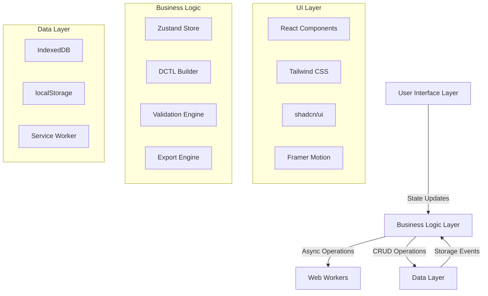

# 1. System Overview

## 1.1 Architecture Principles
- **Zero-Backend**: 100% client-side execution with offline-first PWA
- **Type-Safe**: End-to-end TypeScript with strict type checking
- **Performance-First**: Sub-100ms code generation, Web Workers for heavy lifting
- **Modular Design**: Plugin-based architecture with clear separation of concerns
- **Accessibility**: WCAG 2.1 AA compliance from ground up

## 1.2 High-Level Architecture Diagram

---
