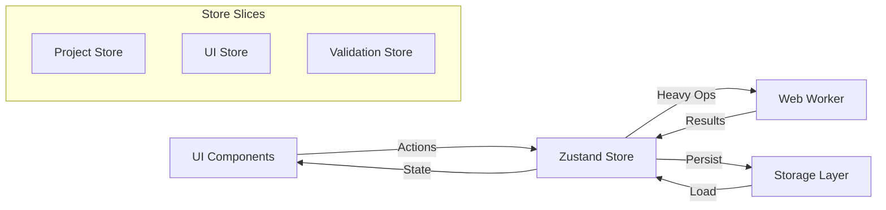

# 3. State Management Architecture

## 3.1 Zustand Store Design

```typescript
// Main project store
interface ProjectStore {
  // State
  project: DctlProject | null;
  isDirty: boolean;
  lastSaved: Date | null;
  
  // Actions
  createProject: (template?: ProjectTemplate) => void;
  loadProject: (id: string) => Promise<void>;
  saveProject: () => Promise<void>;
  exportProject: (format: ExportFormat) => Promise<void>;
  
  // Parameter management
  addParameter: (type: ParameterType) => void;
  updateParameter: (id: string, updates: Partial<ParameterDefinition>) => void;
  removeParameter: (id: string) => void;
  reorderParameters: (from: number, to: number) => void;
  
  // LUT management
  addLut: (file: File) => Promise<void>;
  removeLut: (id: string) => void;
  
  // Code generation
  generateCode: () => string;
  validateCode: () => ValidationResult[];
}

// UI state store
interface UIStore {
  // Layout state
  leftPanelWidth: number;
  rightPanelWidth: number;
  bottomPanelHeight: number;
  
  // Active selections
  selectedParameterId: string | null;
  selectedLutId: string | null;
  
  // Modal states
  modals: {
    addParameter: boolean;
    projectSettings: boolean;
    export: boolean;
  };
  
  // Theme and preferences
  theme: 'light' | 'dark' | 'system';
  fontSize: number;
  autoSave: boolean;
  
  // Actions
  setTheme: (theme: Theme) => void;
  toggleModal: (modal: keyof UIStore['modals']) => void;
  setSelectedParameter: (id: string | null) => void;
}
```

## 3.2 State Flow Diagram



---
