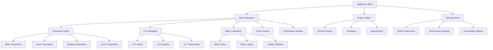
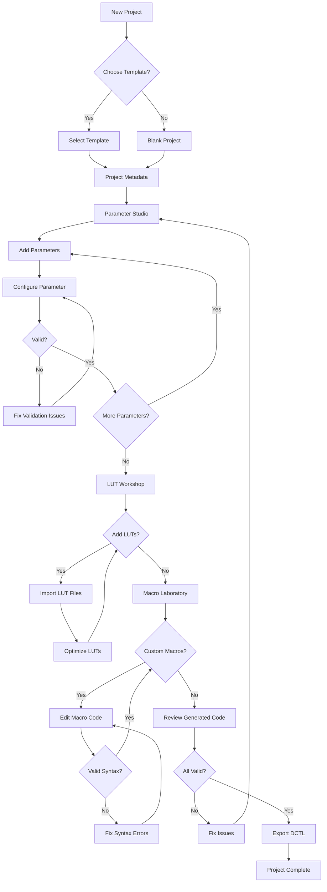
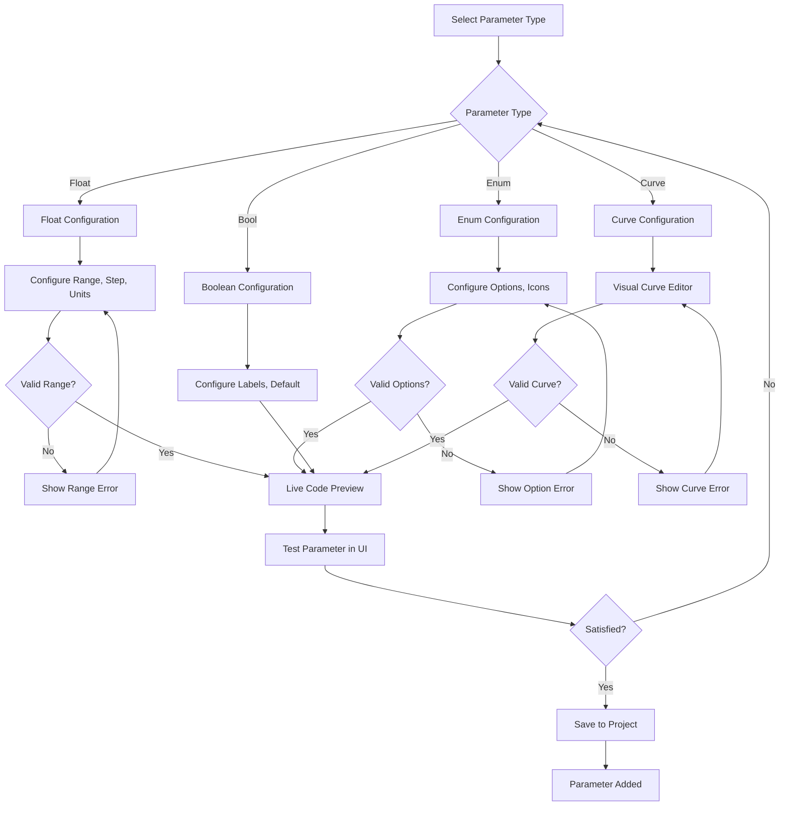
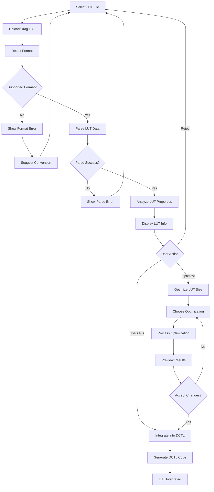

# DCTL Web Generator UI/UX Specification

This document defines the user experience goals, information architecture, user flows, and visual design specifications for DCTL Web Generator's user interface. It serves as the foundation for visual design and frontend development, ensuring a cohesive and user-centered experience.

### Overall UX Goals & Principles

### Target User Personas

**Primary Professional Users:**
- **Colorists:** Senior color professionals creating custom looks and film emulation DCTLs. Need precision controls, batch processing, and integration with professional workflows. Expect industry-standard UI patterns and minimal learning curve.
- **DIT Operators:** On-set Digital Imaging Technicians requiring rapid DCTL creation for live monitoring LUTs. Value speed, reliability, and mobile device compatibility for field use.
- **QC Experts:** Post-production quality control specialists focused on technical accuracy and compliance. Require detailed validation feedback, error reporting, and audit trail capabilities.

**Secondary Users:**
- **Plugin Developers:** Technical professionals extending DaVinci Resolve functionality. Need code export, documentation generation, and advanced parameter management.
- **Color Science Students:** Academic users learning color theory and DCTL development. Benefit from educational UI, example templates, and progressive disclosure of complexity.
- **Post-Production Teams:** Collaborative environments requiring project sharing, version control, and standardized workflows.

### Usability Goals

- **Professional Efficiency:** Experienced users can create complex DCTLs in under 10 minutes with keyboard shortcuts and batch operations
- **Zero Learning Curve:** Industry professionals recognize familiar UI patterns and workflows from professional color applications
- **Error Prevention:** Real-time validation with contextual guidance prevents invalid DCTL generation at every step
- **Offline Reliability:** Complete functionality maintained without internet connection for on-set and remote location work
- **Precision Control:** Sub-frame accuracy for all numeric inputs with industry-standard units (stops, degrees, percentages)

### Design Principles

1. **Professional-First Design** - Prioritize industry workflow efficiency over consumer simplicity
2. **Real-Time Feedback** - Every parameter change immediately updates code preview and validation status
3. **Progressive Disclosure** - Essential features accessible immediately, advanced options discoverable but not intrusive
4. **Contextual Intelligence** - UI adapts to user expertise level and current project complexity
5. **Zero-Latency Interaction** - All UI responses must feel instantaneous (<16ms) even during heavy processing

### Change Log

| Date | Version | Description | Author |
| :--- | :------ | :---------- | :----- |
| 2024-12-19 | 1.0 | Initial UI/UX specification | Sally (UX Expert) |

## Information Architecture (IA)

### Site Map / Screen Inventory

### Navigation Structure

**Primary Navigation:** Top-level horizontal tab structure for major workflows - Parameter Studio, LUT Workshop, Macro Laboratory with persistent Code Preview panel

**Secondary Navigation:** Context-sensitive vertical panels within each primary section using collapsible accordion interface

**Breadcrumb Strategy:** Dynamic breadcrumb showing project → section → subsection with quick navigation and visual hierarchy

## User Flows

### DCTL Creation Flow

**User Goal:** Create a complete DCTL file from parameter definitions to export

**Entry Points:** New Project button, Template selection, Import existing project

**Success Criteria:** Valid DCTL file generated and exported with zero syntax errors

#### Flow Diagram

**Edge Cases & Error Handling:**

- Invalid parameter ranges: Real-time validation with visual indicators and suggested corrections
- LUT parsing failures: Detailed error messages with format recommendations and fallback options
- Macro syntax errors: Monaco editor integration with inline error highlighting and fix suggestions
- Export failures: Automatic retry with progressive fallback formats

**Notes:** Flow supports non-linear navigation - users can jump between sections and return with preserved state

### Parameter Configuration Flow

**User Goal:** Configure a specific parameter type with validation and preview

**Entry Points:** Add Parameter button, Duplicate existing parameter, Template parameter

**Success Criteria:** Parameter configured with valid range and integrated into DCTL generation

#### Flow Diagram

### LUT Import and Processing Flow

**User Goal:** Import external LUT file and integrate into DCTL with optimization

**Entry Points:** LUT Workshop drag-and-drop zone, Import button, Project template with LUTs

**Success Criteria:** LUT successfully parsed, optimized, and ready for DCTL integration

#### Flow Diagram

## Wireframes & Mockups

**Primary Design Files:** [Figma Design System - DCTL Generator](https://figma.com/dctl-generator-design)

### Key Screen Layouts

#### Main Application Layout

**Purpose:** Primary workspace for DCTL creation with multi-panel interface

**Key Elements:**

- **Header Bar:** Project title (editable), version selector, action buttons (Save/Export/Settings)
- **Left Panel (40% width):** Tabbed interface for Parameter Studio, LUT Workshop, Macro Laboratory
- **Right Panel (60% width):** Live code preview with syntax highlighting and error overlay
- **Bottom Status Bar:** Validation status, performance metrics, export options
- **Floating Action Button:** Quick add parameter with type selection

**Interaction Notes:** 
- Resizable panels with snap-to-grid functionality
- Keyboard shortcuts for all major actions
- Real-time auto-save with visual indicators
- Contextual help overlay system

**Design File Reference:** [Main Layout - Frame A1](https://figma.com/main-layout-a1)

#### Parameter Configuration Panel

**Purpose:** Detailed configuration interface for individual parameters

**Key Elements:**

- **Parameter Type Selector:** Visual icons for Float, Enum, Boolean, Curve types
- **Configuration Form:** Dynamic form fields based on parameter type
- **Live Preview:** Real-time parameter widget showing actual appearance
- **Validation Feedback:** Inline error messages and suggestion tooltips
- **Advanced Options:** Collapsible advanced settings section

**Interaction Notes:**
- Drag-and-drop parameter reordering in parent list
- Undo/redo functionality for all parameter changes
- Copy/paste parameter configurations
- Parameter templates and presets

**Design File Reference:** [Parameter Panel - Frame B2](https://figma.com/parameter-panel-b2)

#### LUT Workshop Interface

**Purpose:** LUT import, analysis, and optimization workspace

**Key Elements:**

- **Drop Zone:** Large drag-and-drop area with format indicators
- **LUT Gallery:** Thumbnail view of imported LUTs with metadata
- **Analysis Panel:** LUT properties, color space information, quality metrics
- **Optimization Controls:** Size reduction, format conversion, performance tuning
- **Preview Comparison:** Before/after optimization comparison tools

**Interaction Notes:**
- Batch LUT import with progress indicators
- LUT thumbnail generation and caching
- Export individual LUTs or integrated DCTL
- LUT metadata editing and tagging

**Design File Reference:** [LUT Workshop - Frame C3](https://figma.com/lut-workshop-c3)

## Component Library / Design System

**Design System Approach:** Custom design system based on shadcn/ui components with professional color grading tool aesthetics

### Core Components

#### DCTLButton

**Purpose:** Primary interaction element with professional styling and state management

**Variants:** Primary (brand accent), Secondary (neutral), Destructive (red), Ghost (transparent)

**States:** Default, Hover, Active, Disabled, Loading, Focus

**Usage Guidelines:**
- Use Primary for main actions (Export, Save, Add Parameter)
- Secondary for supporting actions (Cancel, Reset, Duplicate)
- Destructive only for permanent deletions with confirmation modal
- Maximum one Primary button per view/section

#### ParameterWidget

**Purpose:** Interactive parameter control matching DCTL parameter types

**Variants:** 
- SliderWidget (float parameters with range visualization)
- EnumWidget (dropdown with searchable options and icons)
- BooleanWidget (toggle switch with custom labels)
- CurveWidget (interactive Bezier curve editor)

**States:** Default, Editing, Disabled, Invalid, Preview

**Usage Guidelines:**
- All widgets must show current value and valid range
- Real-time validation with visual feedback
- Consistent sizing and spacing across all widget types
- Accessibility compliance with screen reader support

#### CodePanel

**Purpose:** Syntax-highlighted code display with Monaco Editor integration

**Variants:** Preview (read-only), Editor (editable), Diff (comparison)

**States:** Loading, Ready, Error, Validating

**Usage Guidelines:**
- DCTL syntax highlighting with custom theme
- Line numbers and minimap for large files
- Error highlighting with hover tooltips
- Find/replace and Go-to-line functionality

#### LUTCard

**Purpose:** Visual representation of imported LUT with metadata and actions

**Variants:** Thumbnail (grid view), Detailed (list view), Comparison (side-by-side)

**States:** Uploading, Processing, Ready, Optimized, Error

**Usage Guidelines:**
- Visual thumbnail generation from LUT data
- Contextual action menu (optimize, export, remove)
- Drag-and-drop reordering and grouping
- Consistent card dimensions and aspect ratios

## Branding & Style Guide

### Visual Identity

**Brand Guidelines:** Professional color grading industry standards with modern web application aesthetics

### Color Palette

| Color Type    | Hex Code   | Usage                                |
| :------------ | :--------- | :----------------------------------- |
| **Primary**   | #3B82F6    | Primary CTAs, active states, links   |
| **Secondary** | #6366F1    | Secondary actions, highlights        |
| **Accent**    | #10B981    | Success states, validation positive  |
| **Success**   | #059669    | Positive feedback, confirmations     |
| **Warning**   | #D97706    | Cautions, performance warnings       |
| **Error**     | #DC2626    | Errors, validation failures          |
| **Neutral**   | #374151-#F9FAFB | Text, borders, backgrounds (scale) |

**Dark Mode Palette:**
| Color Type    | Hex Code   | Usage                                |
| :------------ | :--------- | :----------------------------------- |
| **Primary**   | #60A5FA    | Primary CTAs, active states          |
| **Secondary** | #818CF8    | Secondary actions, highlights        |
| **Surface**   | #1F2937    | Panel backgrounds, cards             |
| **Background**| #111827    | App background, deep surfaces        |

### Typography

**Font Families:**

- **Primary:** Inter (web-optimized, excellent readability at small sizes)
- **Secondary:** JetBrains Mono (monospace for code display)
- **Display:** Inter (consistent with primary for headers)

**Type Scale:**
| Element | Size | Weight | Line Height |
|:--------|:-----|:-------|:------------|
| H1 | 2.25rem (36px) | 700 | 1.2 |
| H2 | 1.875rem (30px) | 600 | 1.3 |
| H3 | 1.5rem (24px) | 600 | 1.4 |
| Body | 0.875rem (14px) | 400 | 1.5 |
| Small | 0.75rem (12px) | 400 | 1.4 |
| Code | 0.875rem (14px) | 400 | 1.6 |

### Iconography

**Icon Library:** Lucide React (consistent line style, professional appearance)

**Usage Guidelines:** 
- 16px icons for inline use, 20px for buttons, 24px for headers
- Consistent 1.5px stroke width throughout application
- Custom DCTL-specific icons for parameter types and operations

### Spacing & Layout

**Grid System:** 12-column CSS Grid with configurable gaps and responsive breakpoints

**Spacing Scale:** 
- Base unit: 4px
- Scale: 4px, 8px, 12px, 16px, 20px, 24px, 32px, 40px, 48px, 64px
- Panel gaps: 16px standard, 24px for major sections

## Accessibility Requirements

### Compliance Target

**Standard:** WCAG 2.1 AA compliance with enhanced professional tool requirements

### Key Requirements

**Visual:**

- Color contrast ratios: 4.5:1 for normal text, 3:1 for large text, 7:1 for critical information
- Focus indicators: Visible 2px outline with high contrast color and 2px offset
- Text sizing: Support browser zoom up to 200% without horizontal scrolling

**Interaction:**

- Keyboard navigation: Complete tab order coverage with logical flow, arrow key navigation within components
- Screen reader support: Comprehensive ARIA labeling, live regions for dynamic content, descriptive text for complex controls
- Touch targets: Minimum 44px hit areas for touch interfaces, adequate spacing between interactive elements

**Content:**

- Alternative text: Descriptive alt text for LUT thumbnails, chart visualizations, and icons
- Heading structure: Logical h1-h6 hierarchy with proper nesting, no skipped levels
- Form labels: Explicit form associations, error message integration, help text linkage

### Testing Strategy

- Automated testing with axe-core integration in CI/CD pipeline
- Manual testing with screen readers (NVDA, VoiceOver, JAWS)
- Keyboard-only navigation testing for all user flows
- Color blindness simulation testing with high contrast alternatives

## Responsiveness Strategy

### Breakpoints

| Breakpoint | Min Width | Max Width | Target Devices      |
| :--------- | :-------- | :-------- | :------------------ |
| Mobile     | 320px     | 767px     | iPhone, Android phones |
| Tablet     | 768px     | 1023px    | iPad, Android tablets |
| Desktop    | 1024px    | 1439px    | Laptops, small monitors |
| Wide       | 1440px    | -         | Large monitors, 4K displays |

### Adaptation Patterns

**Layout Changes:** 
- Mobile: Single panel view with bottom sheet navigation
- Tablet: Collapsible sidebar with main content area
- Desktop: Full multi-panel layout with resizable sections
- Wide: Enhanced spacing and larger hit areas

**Navigation Changes:**
- Mobile: Hamburger menu with slide-out navigation drawer
- Tablet: Tab bar with icon labels, collapsible secondary navigation
- Desktop: Full horizontal tab navigation with visible labels
- Wide: Extended navigation with additional quick actions

**Content Priority:**
- Mobile: Code preview collapsed by default, focus on parameter configuration
- Tablet: Split view with parameter configuration primary, code preview secondary
- Desktop: Equal priority dual-pane layout with simultaneous editing
- Wide: Enhanced preview with additional metadata and analysis panels

**Interaction Changes:**
- Mobile: Touch-optimized controls with larger hit areas and gesture support
- Tablet: Hybrid touch/mouse interactions with hover states
- Desktop: Full keyboard shortcuts and advanced mouse interactions
- Wide: Professional shortcuts and power-user features exposed

## Animation & Micro-interactions

### Motion Principles

- **Purposeful Animation:** Every animation serves a functional purpose (feedback, guidance, state transition)
- **Professional Speed:** Fast animations (150-200ms) maintaining productivity workflow
- **Respect Accessibility:** Honor reduced motion preferences with instant alternatives
- **GPU Optimization:** Transform and opacity changes only for 60fps performance

### Key Animations

- **Panel Transitions:** Smooth panel sliding with easeInOut curve (200ms duration, cubic-bezier(0.4, 0, 0.2, 1))
- **Parameter Updates:** Subtle value change feedback with spring animation (150ms duration, bounce easing)
- **Code Generation:** Progress indicator with indeterminate loading state (continuous until completion)
- **Validation Feedback:** Error highlighting with shake animation (300ms duration, elastic easing)
- **LUT Processing:** Progress visualization with smooth percentage updates (real-time duration)
- **State Transitions:** Component state changes with fade transitions (100ms duration, linear easing)

## Performance Considerations

### Performance Goals

- **Page Load:** <2 seconds on 3G connection with service worker caching
- **Interaction Response:** <16ms for UI updates, <100ms for code generation
- **Animation FPS:** Consistent 60fps for all animations and scrolling

### Design Strategies

- **Virtual Scrolling:** Implement for parameter lists exceeding 50 items
- **Progressive Loading:** Lazy load Monaco Editor and heavy components
- **Optimistic Updates:** Immediate UI feedback with background validation
- **Component Memoization:** React.memo for expensive parameter widgets
- **Image Optimization:** WebP/AVIF for LUT thumbnails with size-based serving

## Next Steps

### Immediate Actions

1. **Design System Implementation:** Create Figma design system with all defined components and variants
2. **Component Development:** Begin React component implementation starting with core ParameterWidget variants
3. **Accessibility Audit:** Establish automated testing pipeline with axe-core and manual testing protocols

### Design Handoff Checklist

- [x] All user flows documented with edge cases and error handling
- [x] Component inventory complete with variants, states, and usage guidelines
- [x] Accessibility requirements defined with specific WCAG 2.1 AA compliance criteria
- [x] Responsive strategy clear with detailed breakpoint adaptations
- [x] Brand guidelines incorporated with professional color grading industry focus
- [x] Performance goals established with measurable targets and optimization strategies

## Checklist Results

### UI/UX Specification Validation

**Completeness Check:**
- ✅ Target user personas defined with specific professional requirements
- ✅ Usability goals aligned with industry workflow efficiency
- ✅ Information architecture supports complex DCTL creation workflows
- ✅ User flows cover complete end-to-end scenarios with error handling
- ✅ Component library designed for professional tool consistency
- ✅ Accessibility requirements exceed baseline WCAG compliance
- ✅ Responsive strategy addresses professional multi-monitor setups
- ✅ Performance goals support real-time code generation requirements

**Technical Alignment:**
- ✅ UI specifications align with React + TypeScript + shadcn/ui architecture
- ✅ Component patterns support Zustand state management integration
- ✅ Design system enables Web Worker integration for heavy processing
- ✅ Accessibility features support keyboard-heavy professional workflows
- ✅ Performance requirements compatible with zero-backend architecture

**Professional Requirements:**
- ✅ UI patterns familiar to color grading industry professionals
- ✅ Precision controls suitable for technical parameter management
- ✅ Offline capability designed into user experience
- ✅ Error handling appropriate for mission-critical production workflows
- ✅ Export options aligned with professional post-production pipelines
